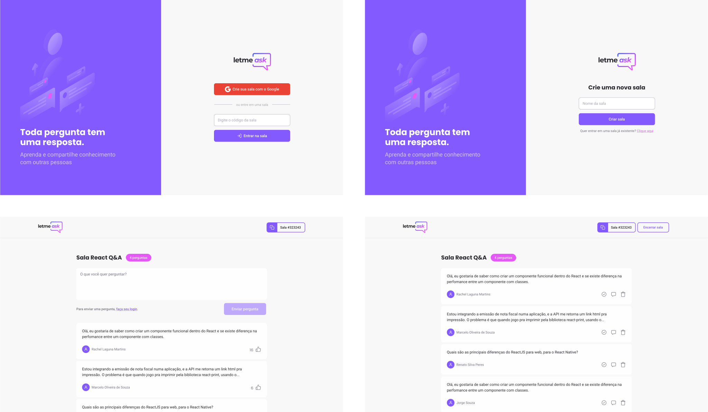

<h1 align="center">
  
  <br />
  <a href="https://www.linkedin.com/in/alexandre-costa-401699199">
    
  </a>
  <a href="https://github.com/alexandredev3/letmeask-nlw06/.github/docs/LICENSE.txt">
    
  </a>
  <a href="https://github.com/alexandredev3/letmeask-nlw06/issues">
    
  </a>
  <a href="https://github.com/alexandredev3/letmeask-nlw06/issues?q=is%3Aissue+is%3Aclosed">
    
  </a>
  <a href="https://github.com/alexandredev3/letmeask-nlw06/network">
    
  </a>
  <a href="https://github.com/alexandredev3/letmeask-nlw06/stargazers">
    
  </a>
</h1>
<p align="center">
  <a href="#page_facing_up-descrição">Descrição</a>&nbsp;&nbsp;&nbsp;|&nbsp;&nbsp;&nbsp;
  <a href="#art-Layout">Layout</a>&nbsp;&nbsp;&nbsp;|&nbsp;&nbsp;&nbsp;
  <a href="#-tecnologias">Tecnologias</a>&nbsp;&nbsp;&nbsp;|&nbsp;&nbsp;&nbsp;
  <a href="#clipboard-Funcionalidades">Funcionalidades</a>&nbsp;&nbsp;&nbsp;|&nbsp;&nbsp;&nbsp;
  <a href="#closed_book-instalação">Instalação</a>&nbsp;&nbsp;&nbsp;|&nbsp;&nbsp;&nbsp;
  <a href="#man-Autor">Autor</a>&nbsp;&nbsp;&nbsp;|&nbsp;&nbsp;&nbsp;
  <a href="#memo-Licença">Licença</a>
</p>



## :page_facing_up: Descrição
Você é um criador de conteúdo? Então o Letmeask é perfeito para você! Com o Letmeask você pode criar salas Q&A com o publico que acompanha você.

Esse projeto foi feito na <a href="https://nextlevelweek.com/inscricao/6"><strong>Next Level Week #06</strong></a> trilha ReactJS.

## :art: Layout
Você pode acessar o Layout pelo <a href="https://www.figma.com">Figma<a> atravês <a href="https://www.figma.com/file/q6C9n8nZCZfCQ7aly6JzEy/Letmeask-(Copy)?node-id=2606%3A1635">desse link<a>.

## 🛠 Tecnologias
Este projeto foi desenvolvido com as seguintes tecnologias

- [React.js](https://pt-br.reactjs.org/)
- [TypeScript](https://www.typescriptlang.org/)
- [Styled Components](https://styled-components.com/)

## :clipboard: Funcionalidades
- [x] Faça login com Google.
- [x] Crie salas.
- [x] Seu público que acessar sua sala pode criar perguntas.
- [x] Seu públuco pode curtir as perguntas de outras pessoas.
- [x] O criador da sala pode marcar perguntas como respondida.
- [x] O criador da sala pode deletar perguntas.
- [x] O criador da sala pode destacar as perguntas.


## :closed_book: Instalação

### Pré-requisitos
Antes de começar, você vai precisar ter instalado em sua máquina as seguintes ferramentas:
[Git](https://git-scm.com), [Node.js](https://nodejs.org/en/), Além disto é bom ter um editor para trabalhar com o código como [VSCode](https://code.visualstudio.com/)

Lembrando que este projeto foi feito com o <a href="https://firebase.google.com/">Firebase</a>.
Aqui vai uma lista do que você vai precisar fazer no seu firebase para rodar esse projeto:
  - Criar um projeto no firebase.
  - Configurar autenticação com o Google.
  - Configurar regras no Realtime Firebase <a href="./.github/docs/rules.json">Link para acessar as regras</a>
  - Preencher todas as variaveis ambientes <a href="./.env.template">Link do template</a>

```bash
# Clone este repositório.
$ git clone https://github.com/alexandredev3/letmeask-nlw06.git

# Vá para a pasta podcastr-nlw05
$ cd letmeask-nlw06

# Instale as dependências
$ npm install 

# Execute aplicação
$ npm run start

# O app vai está rodando na porta 3000 - acesse <http://localhost:3000>
```

## :man: Autor

<a href="https://github.com/alexandredev3/">
 
 <br />
 <sub><b>Alexandre Costa</b></sub>
</a>


Feito com ❤️ por Alexandre Costa :wave::wave: Entre em contato!🚀

<a href="https://www.linkedin.com/in/alexandre-costa-dos-santos">
  
</a>


## :memo: Licença

Copyright © 2020 [Alexandre Costa](https://github.com/alexandredev3).<br />
This project is [MIT](./.github/docs/LICENSE.txt) licensed.
